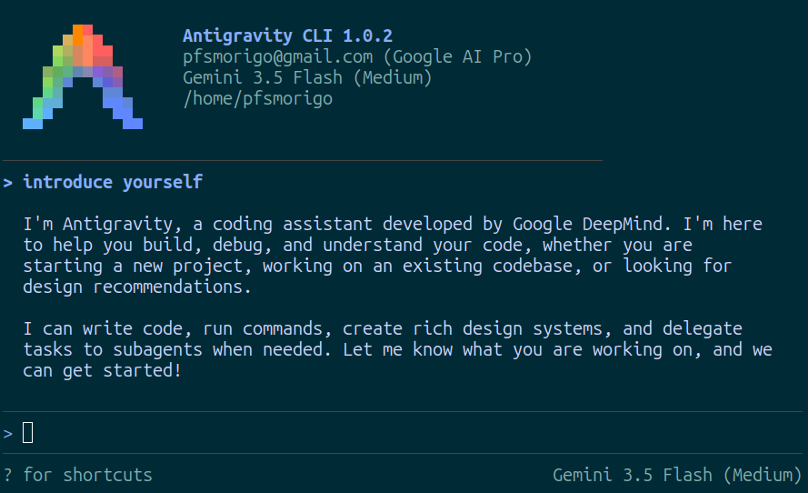
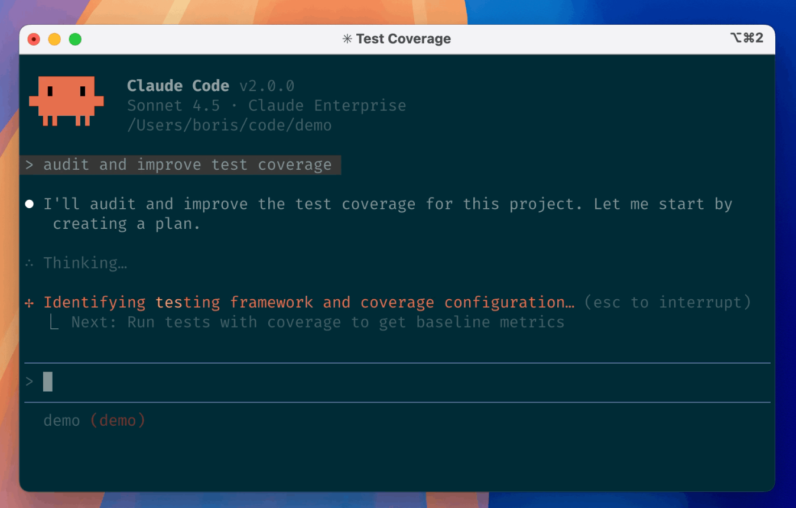
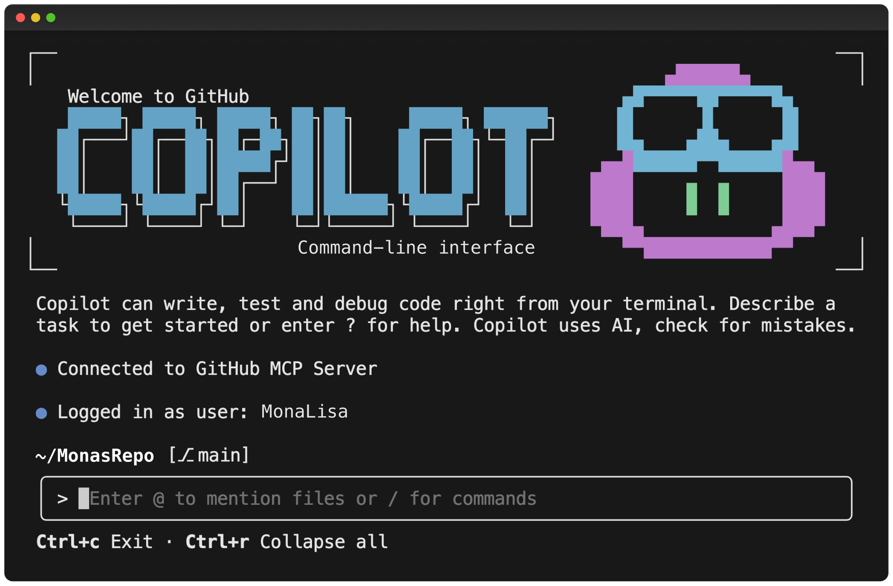
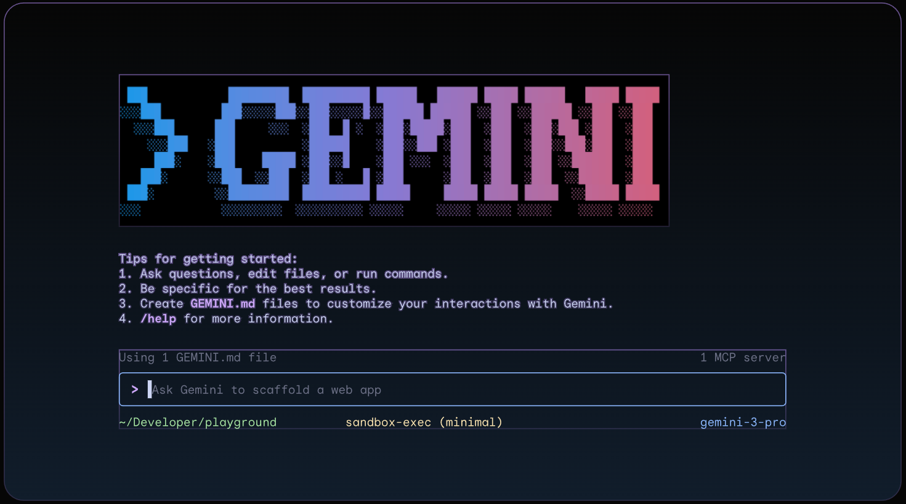
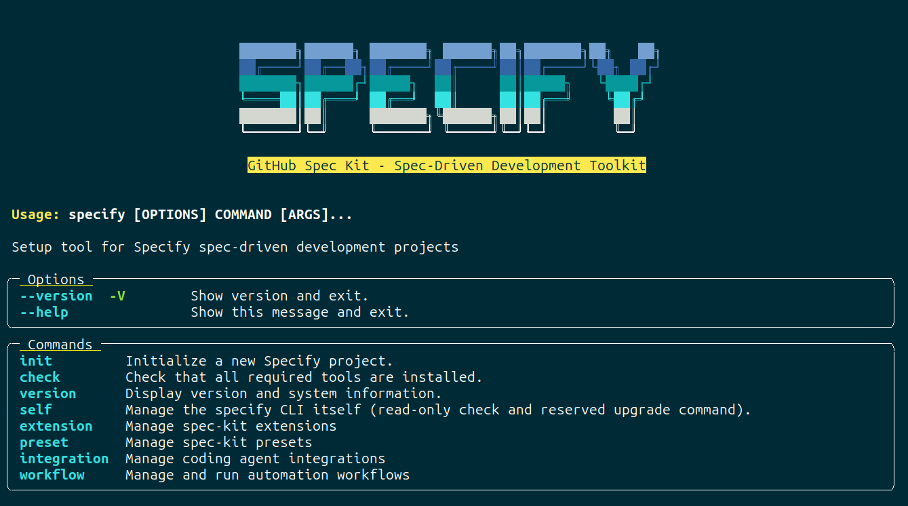

# Snaps Repository

This repository contains unofficial snap wrappers for various tools.

## Available Snaps

### [Antigravity CLI](antigravity-cli)

Antigravity CLI understands your codebase, makes edits with your permission,
and executes commands — right from your terminal.

---

### [Claude Code](claude-code)

Claude Code is an agentic coding tool that lives in your terminal,
understands your codebase, and helps you code faster by executing routine
tasks, explaining complex code, and handling git workflows - all through
natural language commands.

---

### [Copilot CLI](copilot-cli)

An open-source AI agent that brings the power of Copilot directly into
your terminal.

---

### [Gemini CLI](gemini-cli)

An open-source AI agent that brings the power of Gemini directly into
your terminal.

---

### [GitHub Spec Kit](spec-kit)

An open source toolkit that allows you to focus on product scenarios and
predictable outcomes instead of vibe coding every piece from scratch.

---

